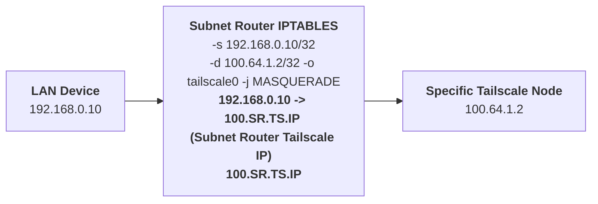
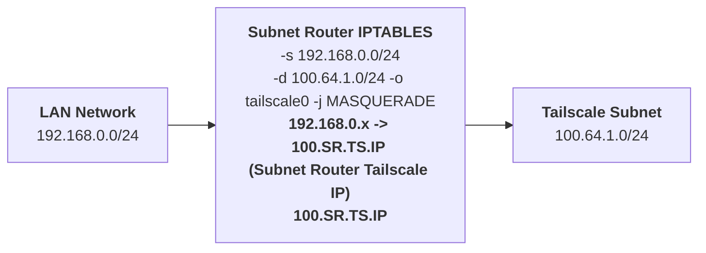
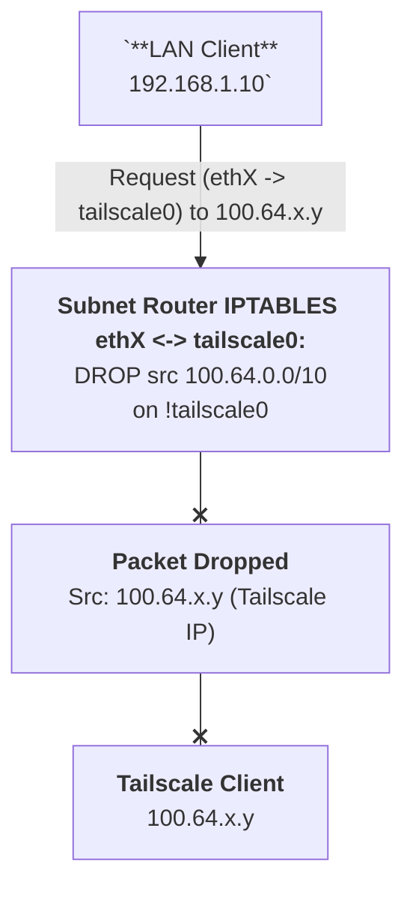
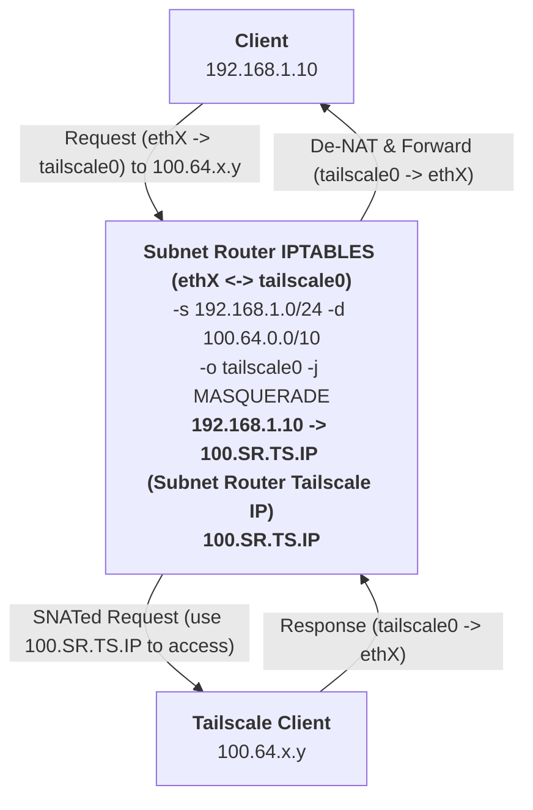
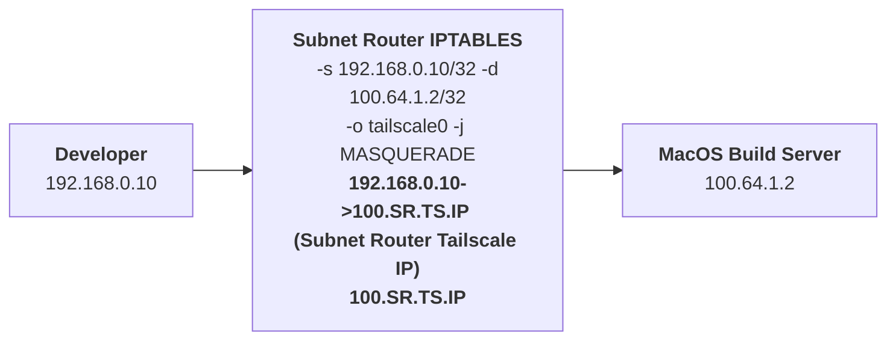
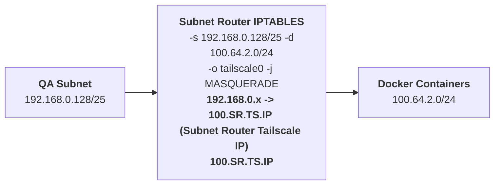
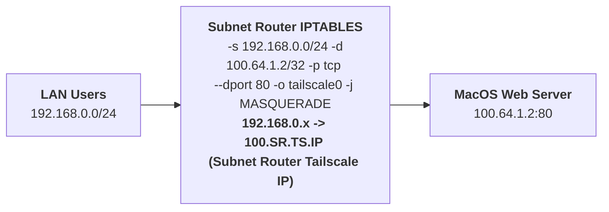

## Devices located behind Tailscale subnet router
### Don't have Tailscale
- To connect to another subnets through Tailscale router, we need to set up routing table.
- For example, we have Tailscale subnet router has LAN IP as `192.168.0.100`, and we want to access `192.168.1.0/24` subnet and [Tailscale IPs](https://tailscale.com/kb/1015/100.x-addresses) `100.64.0.0/10` that in another Tailscale subnet router. So we routing traffic destinate to `192.168.1.0/24` in our machine to Tailcsale router machine `192.168.0.100`

```ad-note
Some machines don't accept all incomming trafic by default, we may need to set up to accept another subnets in Firewall manually.
```

#### Linux
- [Tailscale Document](https://tailscale.com/kb/1214/site-to-site#example-scenario)
```sh
ip route add 100.64.0.0/10 via 192.168.0.100
ip route add 192.168.1.0/24 via 192.168.0.100
```

- To make route rules persistent on reboot, we can use `netplan` config
```yaml
# In case of VM running on Proxmox
# /etc/netplan/50-cloud-init.yaml
network:
    version: 2
    ethernets:
        eth0:
			...
            routes:
			...
            - to: 192.168.0.0/24
              via: 192.168.001.100
            - to: 100.64.0.0/10
              via: 192.168.1.100
			...

```

```ad-caution
Title: Netplan on Proxmox VMs & cloud-init
On Proxmox Virtual Machines, `cloud-init` often manages network configuration and can overwrite manual changes made to `/etc/netplan/50-cloud-init.yaml` (or similar files) upon reboot. This can lead to static routes defined in `netplan` not persisting as expected.

For more reliable and persistent route configuration in Proxmox VMs, consider using the `networkd-dispatcher` method detailed later in this document (see section "Implementation"). This approach is less susceptible to `cloud-init` overwrites for dynamic route management.
```

- [[Linux Security Improved. Create professional Netfilter Iptables Firewalls. All you need to know about Netfilter Iptables#16. Listing the Firewall | Check iptables INPUT chain]] ACCEPT other subnets
```sh
sudo iptables -vnL INPUT
```

- If not, ACCEPT those subnet IPs to INPUT chain.
```sh
sudo iptables -I INPUT -s 100.64.0.0/10 -j ACCEPT
```

#### Windows
- [[202408311552 Enable Routing on Windows | Use Windows route command]]
```powershell
route add 100.64.0.0 mask 255.192.0.0 192.168.0.100
route add 192.168.1.0 mask 255.255.255.0 192.168.0.100
```

### Have Tailscale
- With some machine that use Tailscale as secure SSH Bastion machine, we need to adjust routing table for Tailscale IPs `100.64.0.0/10` not going to current machine `tailscale0` network interface, but forward to Tailscale router runing on `192.168.0.100` IP in this example.

#### Linux
- [Make routing rule priority higher than Tailscale routing table](https://tailscale.com/kb/1023/troubleshooting#lan-traffic-prioritization-with-overlapping-subnet-routes).
```sh
ip rule add to 100.64.0.0/10 priority 2500 lookup main
```

### <mark>Multiple Tailscale Nodes on Same LAN</mark>

#### Scenario: Accessing a Service on a Tailscale Node via its Advertised LAN IP

A more complex situation arises when you have a Tailscale node (`ServiceNode`) that hosts a service (e.g., a web server) and its private LAN IP address (e.g., `192.168.10.100`) is part of a subnet (e.g., `192.168.10.0/24`) that is advertised to your Tailscale network by a *different* Tailscale node acting as a subnet router (`SubnetRouterNode`).

Consider this setup:
- `ServiceNode`: Has Tailscale installed. LAN IP is `192.168.10.100`. Hosts a service.
- `SubnetRouterNode`: Has Tailscale installed. Advertises the `192.168.10.0/24` subnet to your tailnet. Its LAN IP might be `192.168.10.200` and its Tailscale IP is `100.A.B.C`.
- `ClientNode`: Another Tailscale node (e.g., your laptop, Tailscale IP `100.X.Y.Z`) wants to access the service on `ServiceNode` by connecting to `192.168.10.100`.

**The Challenge:**
When `ClientNode` (at `100.X.Y.Z`) sends a packet to `192.168.10.100`:
1. Tailscale on `ClientNode` knows `192.168.10.0/24` is routed via `SubnetRouterNode` (`100.A.B.C`).
2. The packet is sent to `SubnetRouterNode`.
3. `SubnetRouterNode` forwards the packet onto the `192.168.10.0/24` LAN. The source IP reaching `ServiceNode` will be `100.X.Y.Z` if `SubnetRouterNode` has `--snat-subnet-routes=false`. If `--snat-subnet-routes=true` (default), `ServiceNode` would see `SubnetRouterNode`'s LAN IP as the source, simplifying return routing. For this explanation, we consider the more complex case where `ServiceNode` sees the original `100.X.Y.Z` source.
4. `ServiceNode` at `192.168.10.100` receives the packet from `100.X.Y.Z`.

Now, `ServiceNode` needs to send a reply back to `100.X.Y.Z`. The behavior here critically depends on `ServiceNode`'s Tailscale configuration, particularly its `--accept-routes` setting:

*   **If `ServiceNode` runs with `--accept-routes=false`:**
    *   Its OS routing table will *not* have routes for `100.64.0.0/10` (the Tailscale network) automatically installed by Tailscale.
    *   When its service (listening on `192.168.10.100`) tries to reply to `100.X.Y.Z`, it will likely consult its default LAN gateway.
    *   If this LAN gateway doesn't know how to reach `100.X.Y.Z` (which is typical), the reply fails. `ServiceNode` effectively doesn't know how to send packets back into the Tailscale network.

    ```mermaid
    graph LR
        ClientNode["`**ClientNode**<br>100.X.Y.Z`"]

        subgraph SubnetRouterMachine [SubnetRouterNode<br><b>192.168.10.0/24</b>]
            direction TB
            SRN_TS["`Tailscale Interface (100.A.B.C)`"]
            SRN_LAN["`LAN Interface (192.168.10.200)`"]
            SRN_TS -- "Internal Forwarding" --- SRN_LAN
        end

        subgraph LAN [Private LAN 192.168.10.0/24]
            direction TB
            ServiceNode["`**ServiceNode**<br>192.168.10.100<br>Tailscale Client<br>--accept-routes=false`"]
            DefaultGW["`**Default LAN Gateway**<br>(e.g., 192.168.10.1)`"]
        end

        ClientNode -- "<b>1</b> Request to 192.168.10.100" --> SRN_TS
        SRN_LAN -- "<b>2</b> Forwarded packet to 192.168.10.100<br>(Original Src: 100.X.Y.Z)" --> ServiceNode
        ServiceNode -- "<b>3</b> Reply to 100.X.Y.Z" --> DefaultGW
        DefaultGW -- "<b>4</b> No route to 100.X.Y.Z<br><b>REPLY FAILS</b>" ---x ClientNode

        style DefaultGW fill:#f9f,stroke:#333,stroke-width:2px
        style ServiceNode fill:#f9f,stroke:#333,stroke-width:2px
    ```

*   **If `ServiceNode` runs with `--accept-routes=true` (default):**
    *   Its OS routing table *will* have routes for `100.64.0.0/10` pointing to its `tailscale0` interface.
    *   When its service (listening on `192.168.10.100`) tries to reply to `100.X.Y.Z`, the OS might use these Tailscale-provided routes.
    *   However, this can lead to asymmetric routing or unexpected behavior. The reply from `ServiceNode` would go directly out its own `tailscale0` interface to `ClientNode`. While this might *seem* to work, the `SubnetRouterNode` (which handled the initial inbound routing for the subnet) is bypassed for the return traffic. This can be problematic for stateful firewalls or if `SubnetRouterNode` needs to manage/log all traffic for the advertised subnet. It also differs from how non-Tailscale devices on `192.168.10.0/24` would have their traffic routed by `SubnetRouterNode`.

    ```mermaid
    graph LR
        ClientNode["`**ClientNode**<br>100.X.Y.Z`"]

        subgraph SubnetRouterMachine [SubnetRouterNode<br><b>192.168.10.0/24</b>]
            direction TB
            SRN_TS["`Tailscale Interface (100.A.B.C)`"]
            SRN_LAN["`LAN Interface (192.168.10.200)`"]
            SRN_TS -- "Internal Forwarding" --- SRN_LAN
        end

        subgraph ServiceNodeMachine [ServiceNode Machine]
            direction TB
            SN_LAN["`LAN Interface (192.168.10.100)<br>Service Listener`"]
            SN_TS["`Tailscale Interface (100.S.T.U)<br>--accept-routes=true`"]
            SN_LAN -- "OS Routing" --- SN_TS
        end
        
        LAN_Placeholder["`Private LAN 192.168.10.0/24`"] --- SRN_LAN
        LAN_Placeholder["`Private LAN 192.168.10.0/24`"] --- SN_LAN


        ClientNode -- "<b>1</b> Request to 192.168.10.100" --> SRN_TS
        SRN_LAN -- "<b>2</b> Forwarded to 192.168.10.100<br>(Original Src: 100.X.Y.Z)" --> SN_LAN
        SN_TS -- "<b>3</b> Reply to 100.X.Y.Z<br>(Directly via its Tailscale IF)<br><b>ASYMMETRIC ROUTING</b>" --> ClientNode

        style SN_TS fill:#ccf,stroke:#333,stroke-width:2px
        style SRN_TS fill:#f9f,stroke:#333,stroke-width:2px
    ```

**Solution: Ensuring Consistent and Correct Reply Routing from `ServiceNode`**
To ensure `ServiceNode` can reliably route replies back to `ClientNode` and maintain routing symmetry (especially if `SubnetRouterNode` handles firewalling or monitoring for the `192.168.10.0/24` subnet), the recommended approach is often to guide `ServiceNode`'s replies through `SubnetRouterNode`. This is particularly crucial if `ServiceNode` operates with `--accept-routes=false`.

1.  **Static Route on `ServiceNode` via `SubnetRouterNode`'s LAN IP (Recommended for `--accept-routes=false` or for routing consistency):**
    `ServiceNode` should be configured to route all traffic destined for the Tailscale network (`100.64.0.0/10`) via the `SubnetRouterNode`'s LAN IP (e.g., `192.168.10.200`).
    ```sh
    # On ServiceNode (Linux example)
    sudo ip route add 100.64.0.0/10 via 192.168.10.200 dev eth0 
    # Replace eth0 with ServiceNode's actual LAN interface.
    # Ensure this route has a higher precedence than any default LAN gateway for this destination.
    ```
    This explicitly directs `ServiceNode`'s replies for Tailscale IPs towards `SubnetRouterNode` on the LAN. `SubnetRouterNode`'s Tailscale daemon will then correctly forward this traffic to `ClientNode` over the Tailscale network. This maintains routing symmetry.

    ```mermaid
    graph LR
        ClientNode["`**ClientNode**<br>100.X.Y.Z`"]

        subgraph SubnetRouterMachine [SubnetRouterNode<br><b>192.168.10.0/24</b>]
            direction TB
            SRN_TS["`Tailscale Interface (100.A.B.C)"]
            SRN_LAN["`LAN Interface (192.168.10.200)`"]
            SRN_TS -- "Internal Forwarding" --- SRN_LAN
        end

        subgraph ServiceNodeMachine [ServiceNode Machine]
            direction TB
            SN_LAN["`**ServiceNode LAN IF**<br>192.168.10.100<br>Static Route:<br>100.64.0.0/10 via 192.168.10.200`"]
            SN_Service["`Service Listener`"]
            SN_LAN -- "Hosts" --- SN_Service
        end
        
        LAN_Placeholder["`Private LAN 192.168.10.0/24`"] --- SRN_LAN
        LAN_Placeholder --- SN_LAN

        ClientNode -- "<b>1</b> Request to 192.168.10.100" --> SRN_TS
        SRN_LAN -- "<b>2</b> Forwarded to 192.168.10.100<br>(Original Src: 100.X.Y.Z)" --> SN_LAN
        SN_LAN -- "<b>3</b> Reply to 100.X.Y.Z (via 192.168.10.200)" --> SRN_LAN
        SRN_TS -- "<b>4</b> Forwarded Reply to 100.X.Y.Z" --> ClientNode

        style SN_LAN fill:#cfc,stroke:#333,stroke-width:2px
        style SRN_LAN fill:#cfc,stroke:#333,stroke-width:2px
    ```

2.  **Enable SNAT on `SubnetRouterNode` (Simplifies `ServiceNode` configuration):**
    If `SubnetRouterNode` performs Source NAT (SNAT) for traffic it forwards from `ClientNode` to `ServiceNode` (typically by ensuring `--snat-subnet-routes=true`, which is the default on the subnet router), then `ServiceNode` will see all incoming traffic from `ClientNode` as originating from `SubnetRouterNode`'s LAN IP (e.g., `192.168.10.200`).
    - Replying to this LAN IP is straightforward for `ServiceNode` as it's on the same subnet and requires no special Tailscale-related routes on `ServiceNode`.
    - `SubnetRouterNode` then handles de-SNATing the reply and sending it back to `ClientNode` over Tailscale.
    - This is often the simplest solution as it centralizes the routing complexity on `SubnetRouterNode` and `ServiceNode` requires no special static routes for the Tailscale network.

    ```mermaid
    graph LR
        ClientNode["`**ClientNode**<br>100.X.Y.Z`"]

        subgraph SubnetRouterMachine [SubnetRouterNode<br><b>192.168.10.0/24</b>]
            direction TB
            SRN_TS["`Tailscale Interface (100.A.B.C)`"]
            SRN_LAN["`LAN Interface (192.168.10.200)<br>Performs SNAT`"]
            SRN_TS -- "Internal Forwarding & SNAT" --- SRN_LAN
        end

        subgraph ServiceNodeMachine [ServiceNode Machine]
            direction TB
            SN_LAN["`**ServiceNode LAN IF**<br>192.168.10.100<br>Sees src IP as 192.168.10.200`"]
            SN_Service["`Service Listener`"]
            SN_LAN -- "Hosts" --- SN_Service
        end

        LAN_Placeholder["`Private LAN 192.168.10.0/24`"] --- SRN_LAN
        LAN_Placeholder --- SN_LAN
        
        ClientNode -- "<b>1</b> Request to 192.168.10.100" --> SRN_TS
        SRN_LAN -- "<b>2</b> Forwarded to 192.168.10.100<br>(SNATed Src: 192.168.10.200)" --> SN_LAN
        SN_LAN -- "<b>3</b> Reply to 192.168.10.200" --> SRN_LAN
        SRN_TS -- "<b>4</b> De-SNATed & Forwarded Reply<br>to 100.X.Y.Z" --> ClientNode

        style SRN_LAN fill:#cfc,stroke:#333,stroke-width:2px
    ```

**Key Consideration:**
The main goal is to prevent `ServiceNode` from sending replies to `100.X.Y.Z` via its default physical LAN gateway if that gateway cannot reach the Tailscale network. The traffic must be directed back into the Tailscale network, typically via the `SubnetRouterNode` that advertised its subnet.

#### Setup
1. <strong>Disable Router Functionality</strong>:
   - For all <mark>non-router Tailscale nodes</mark>, disable their router functionality to prevent routing conflicts.
   - Ensure <code>--advertise-routes</code> is <mark>not set</mark> on these nodes.
   - <mark>Disable route and DNS acceptance</mark> to prevent routing table conflicts:
     <pre><code>tailscale up --accept-routes=false --accept-dns=false</code></pre>
     <blockquote>This prevents the node from accepting routes advertised by other Tailscale nodes and using Tailscale DNS, which could conflict with local routing.</blockquote>

2. <strong>Route Rule Configuration</strong>:
   - To ensure proper traffic flow, requests coming from the <mark>Tailscale router</mark> to another Tailscale node must be routed back through the Tailscale router.
   - This prevents direct node-to-node communication which could bypass the router.
   - <mark>Add route rules</mark> on non-router Tailscale nodes to forward Tailscale subnet traffic (<code>100.64.0.0/10</code>) to the Tailscale router.

<strong>Example configuration for non-router nodes</strong> (assuming Tailscale router is at <code>192.168.0.100</code>):

##### Linux
```bash
# Add route rule with higher priority than Tailscale's default routes
ip rule add to 100.64.0.0/10 priority 2500 lookup main

# Add route for Tailscale subnet via SubnetRouterNode
ip route add 100.64.0.0/10 via 192.168.10.200

# Add route for another private subnet via SubnetRouterNode
ip route add 192.168.20.0/24 via 192.168.10.200
```

##### Windows
```powershell
route add 100.64.0.0 mask 255.192.0.0 192.168.0.100
```

## <mark>NAT Configuration for Subnet Router</mark>

When a client on one private subnet (e.g., `192.168.1.0/24`) attempts to access a **Tailscale node** (e.g., `100.X.Y.Z`) that resides on, or is accessed via, a different private subnet (exposed by a subnet router), direct communication can often fail. This is because most common operating systems, including **Windows**, **macOS**, and **Linux**, have built-in security measures or default firewall configurations that **block incoming network connections from IP addresses that are not part of their own local private subnet.** Even if network routes are correctly configured to guide the packets, the target machine's OS may simply refuse or drop packets originating from an unfamiliar private IP range.

Additionally, **Tailscale clients** themselves are designed with security in mind and typically only accept connections from other recognized **Tailscale IPs** within your **Tailnet** or from their own local subnet.

To overcome these restrictions and enable seamless access, **Network Address Translation (NAT)** is employed on the **subnet router**. Specifically, using **`MASQUERADE`** (a common NAT target in `iptables` on Linux), the subnet router modifies the source IP address of the packets coming from the client. As these packets are forwarded to the target **Tailscale node**, their source IP is changed to an IP address that the target node trusts. This is typically the **Tailscale IP of the subnet router itself** or the subnet router's IP on the LAN if the target Tailscale node is also on that same LAN. By doing this, the traffic appears to the target **Tailscale node** (and its OS) as if it's originating from a trusted source (e.g., from within the **Tailnet** or the local LAN), thus bypassing the default OS-level blocking and allowing the connection to be established.

**NAT is especially critical** in scenarios where you need clients from a different subnet to access **Tailscale-connected machines** that you cannot easily reconfigure to explicitly allow connections from other specific private subnets (e.g., managed corporate laptops, IoT devices, or appliances).

Configuring NAT on your subnet router when routing traffic towards the **Tailscale network** (`100.64.0.0/10`) or other Tailscale-accessible resources offers several benefits, particularly for handling return traffic correctly and ensuring connectivity:

#### <mark>Configuring NAT on Linux Subnet Router</mark>
You can configure NAT rules with varying levels of specificity depending on your security requirements:

```sh
# General NAT for all Tailscale subnet traffic
sudo iptables -t nat -A POSTROUTING -s 100.64.0.0/10 -o tailscale0 -j MASQUERADE

# Specific NAT for a single Tailscale IP to access a specific service
sudo iptables -t nat -A POSTROUTING -s 100.xxx.yyy.zzz/32 -d 192.168.1.1/32 -o eth0 -j MASQUERADE

# NAT for specific source and destination subnets
sudo iptables -t nat -A POSTROUTING -s 192.168.0.0/24 -d 100.64.0.0/10 -o tailscale0 -j MASQUERADE

# General NAT for all Tailscale network access
sudo iptables -t nat -A POSTROUTING -s 192.168.0.0/24 -o tailscale0 -j MASQUERADE

# NAT for specific source and destination
sudo iptables -t nat -A POSTROUTING -s 192.168.0.10/32 -d 100.64.1.2/32 -o tailscale0 -j MASQUERADE

# NAT for specific source subnet to specific Tailscale nodes
sudo iptables -t nat -A POSTROUTING -s 192.168.0.0/24 -d 100.64.1.0/24 -o tailscale0 -j MASQUERADE
```

Make these rules persistent in `/etc/iptables/rules.v4`:
```sh
*filter
COMMIT
*nat
# NAT specific source IP to specific Tailscale node
-A POSTROUTING -s 192.168.x.y/32 -d 100.xxx.yyy.zzz/32 -o eth0 -j MASQUERADE

# NAT rules for subnets
-A POSTROUTING -s 192.168.0.0/24 -d 100.64.1.0/24 -o tailscale0 -j MASQUERADE
COMMIT
```

#### Example Scenarios

1.  **Single Host to Single Tailscale Node:**



2.  **Subnet to Specific Tailscale Subnet:**



#### Benefits of Specific NAT Rules
1. Better Security:
   - Limit which local devices can access specific Tailscale nodes
   - Prevent unauthorized access to other Tailscale resources
2. Improved Control:
   - Fine-grained control over which devices can communicate
   - Easier to audit and manage access patterns
3. Better Troubleshooting:
   - Clear mapping between source and destination
   - Easier to track issues when they occur

> Note: When using specific destination IPs, make sure to update the rules if the Tailscale IPs change (though this is rare in a stable Tailscale network).

#### Response Traffic and NAT Implications
A fundamental aspect of Tailscale's networking model is how response traffic is handled. When any machine (whether it's a Tailscale node itself or a LAN device communicating via a Tailscale subnet router) initiates a connection to a Tailscale IP address (within the `100.64.0.0/10` range), the ensuing response traffic *must* be routed back to the originating node or subnet router exclusively through its `tailscale0` interface. Tailscale enforces this strictly: if a response packet, despite having a legitimate Tailscale source IP, attempts to enter a node via a different physical or virtual interface (like `eth0`), it will be intentionally dropped. This policy is enforced by the following default `iptables` rule on Tailscale nodes:
```sh
DROP       all  --  !tailscale0 *       100.64.0.0/10        0.0.0.0/0
```

This `iptables` rule, automatically configured by Tailscale, is a critical security and routing measure. Let's break it down:
*   `DROP`: The action taken if a packet matches the rule – it's silently discarded.
*   `all`: This rule applies to all IP protocols (TCP, UDP, ICMP, etc.).
*   `--`: Separator for options.
*   `!tailscale0` (as an input interface condition): This is the key part. It matches if the packet is **NOT** received on the `tailscale0` interface. The `!` inverts the interface match.
*   `*` (as an output interface condition): This means the rule applies regardless of the intended output interface.
*   `100.64.0.0/10` (as source IP): This matches if the packet's source IP address falls within Tailscale's CGNAT address range.
*   `0.0.0.0/0` (as destination IP): This matches any destination IP address.

**In plain English, this rule states: "If a packet arrives on any network interface *other than* `tailscale0`, and this packet claims to be *from* a Tailscale IP address (100.64.0.0/10), then drop that packet."**

**Why this rule is important for response traffic and NAT:**
This rule strictly enforces that all communication originating from the Tailscale network must enter a node via its `tailscale0` interface. When a LAN device sends a request to a Tailscale service *through* a subnet router:
1.  The initial request from the LAN device (e.g., `192.168.1.10`) goes to the subnet router.
2.  The subnet router, if NAT (`MASQUERADE` on `tailscale0`) is correctly configured, changes the source IP of the packet to its own Tailscale IP (e.g., `100.X.Y.Z`) before sending it out via `tailscale0` to the destination Tailscale service.
3.  The destination Tailscale service sees the request as coming from `100.X.Y.Z` (the subnet router's Tailscale IP) and sends its response back to `100.X.Y.Z`.
4.  This response arrives at the subnet router *on its `tailscale0` interface*. Because it arrived on `tailscale0`, it passes the `DROP` rule.
5.  The subnet router's NAT conntrack entries then correctly de-NAT the packet (changing the destination back to the original LAN device `192.168.1.10`) and forward it onto the LAN.

If NAT is misconfigured, or if the response somehow tries to bypass `tailscale0` and arrive on, say, `eth0` of the subnet router, the `DROP` rule will discard it because the source IP is from the `100.64.0.0/10` range but the input interface is `!tailscale0`. This prevents IP spoofing and ensures routing integrity within the Tailscale network.

This has important implications for NAT configuration:
1.  **Direct Routing Issue without NAT (or misconfigured NAT leading to incorrect return path):**


2.  **Correct NAT Setup ensuring return via `tailscale0`:**


   The `iptables` rule for this:
   ```sh
   # Ensure responses go through tailscale0
   sudo iptables -t nat -A POSTROUTING -s 192.168.1.0/24 -d 100.64.0.0/10 -o tailscale0 -j MASQUERADE
   ```
   This NAT rule ensures that:
   - Requests from local network (192.168.1.0/24) to Tailscale IPs (100.64.0.0/10)
   - Are masqueraded (source NAT) and routed through tailscale0
   - Responses will naturally return through tailscale0, avoiding the DROP rule

3. **Common Mistake to Avoid**:
   ```sh
   # Incorrect: This might cause responses to come through eth0
   sudo iptables -t nat -A POSTROUTING -o eth0 -j MASQUERADE
   ```
   This general NAT rule might cause Tailscale responses to try returning via eth0, leading to dropped packets.

#### Making iptables Rules Persistent
iptables rules do not persist after reboot by default. To make them persistent:

1. Install iptables-persistent:
```sh
sudo apt install iptables-persistent
```

2. Configure persistent rules in `/etc/iptables/rules.v4`:
```sh
*filter
COMMIT
*nat
# NAT rules for specific IPs
-A POSTROUTING -s 192.168.x.y/32 -d 100.xxx.yyy.zzz/32 -o eth0 -j MASQUERADE

# NAT rules for subnets
-A POSTROUTING -s 192.168.0.0/24 -d 100.64.1.0/24 -o tailscale0 -j MASQUERADE
COMMIT
```
The rules will be automatically loaded on system boot.

#### Important Considerations
1. Only configure NAT on the designated subnet router
2. Use specific source and destination IPs when possible for better security
3. Ensure your firewall rules allow forwarded traffic
4. Monitor for potential NAT-related performance impact with large numbers of connections
5. Remember to enable IP forwarding:
```sh
# Enable immediately
sudo sysctl -w net.ipv4.ip_forward=1

# Make persistent
echo "net.ipv4.ip_forward=1" | sudo tee /etc/sysctl.d/99-tailscale.conf
```

## Implementation
To automatically set up the routing rule when network configuration changes, we'll use networkd-dispatcher which is more efficient than a systemd service as it responds to network events in real-time:

1. Create the script `/etc/networkd-dispatcher/routable.d/99-static-routes.sh`:
```sh
#!/bin/sh

# This script is triggered by networkd-dispatcher when network state changes
# Place in /etc/networkd-dispatcher/routable.d/ to run when interfaces become routable

# Configuration
# Environment variables:
# TAILSCALE_ROUTER_IP: The LAN IP of your Tailscale subnet router (default: 192.168.0.100)
# REMOTE_SUBNETS: Space-separated list of remote subnets to route (default: 192.168.1.0/24)
#   Example: REMOTE_SUBNETS="192.168.1.0/24 192.168.2.0/24 10.0.0.0/24"

TAILSCALE_ROUTER_IP="192.168.0.100"
REMOTE_SUBNETS="192.168.1.0/24"

# Add small delay to ensure network is stable
sleep 1

# Add routes if they don't exist
# Route Tailscale subnet (100.64.0.0/10) through the Tailscale subnet router
if ! ip route show | grep -q "100.64.0.0/10 via $TAILSCALE_ROUTER_IP"; then
    logger -t static-routes "INFO: Adding Tailscale subnet route through Tailscale subnet router ($TAILSCALE_ROUTER_IP)..."
    ip route add 100.64.0.0/10 via "$TAILSCALE_ROUTER_IP"
fi

# Route remote LAN subnets through the Tailscale subnet router
for subnet in $REMOTE_SUBNETS; do
    if ! ip route show | grep -q "$subnet via $TAILSCALE_ROUTER_IP"; then
        logger -t static-routes "INFO: Adding remote LAN route for $subnet through Tailscale subnet router ($TAILSCALE_ROUTER_IP)..."
        ip route add "$subnet" via "$TAILSCALE_ROUTER_IP"
    fi
done
```

2. Create the script `/etc/networkd-dispatcher/routable.d/99-tailscale-route-rule.sh` to add the Tailscale routing rule with higher priority:
```sh
#!/bin/sh

# This script is triggered by networkd-dispatcher when network state changes
# Place in /etc/networkd-dispatcher/routable.d/ to run when interfaces become routable

# Add small delay to ensure network is stable
sleep 1

# Add Tailscale routing rule if it doesn't exist
if ! ip rule show | grep -q "2500:.*from all to 100.64.0.0/10 lookup main"; then
	logger -t tailscale-route-rule "INFO: Adding Tailscale routing rule..."
	ip rule add to 100.64.0.0/10 priority 2500 lookup main
	logger -t tailscale-route-rule "INFO: Tailscale routing rule has been added successfully"
fi
```

3. Make the scripts executable:
```sh
sudo chmod +x /etc/networkd-dispatcher/routable.d/99-static-routes.sh
sudo chmod +x /etc/networkd-dispatcher/routable.d/99-tailscale-route-rule.sh
```

You can verify the routes and rules are applied by checking:
```bash
ip route show
```

## Tailscale ACL Configuration
For subnet routers to properly access Tailscale machines, you need to configure appropriate ACLs in your Tailscale admin console. ACLs control both direct Tailscale connections and subnet routing access.

### Basic ACL Structure
```json5
{
    // Define user groups
    "groups": {
        "group:admin": ["admin@example.com"],
        "group:devops": ["devops@example.com"],
    },

    // Define who can assign tags
    "tagOwners": {
        "tag:vpn-site-office": ["autogroup:admin"],  // Subnet routers
        "tag:server": ["autogroup:admin"],           // Server nodes
        "tag:container": ["autogroup:admin"],        // Docker containers
        "tag:recorder": ["autogroup:admin"]          // SSH recording nodes
    },

    // Define access control lists
    "acls": [
        // Admin access to everything
        {
            "action": "accept",
            "src": ["autogroup:admin"],
            "dst": ["*:*"]
        },

        // Allow site-to-site VPN connections
        {
            "action": "accept",
            "src": ["tag:vpn-site-office", "officeA-lan", "officeB-lan"],
            "dst": [
                "officeA-nas-server:*",
                "officeA-services-proxy-server:*",
                "officeA-dns-server:53",
                "tag:server:*"
            ]
        },

        // Allow subnet router to access Tailscale nodes
        {
            "action": "accept",
            "src": ["officeA-vpn-router-tailscale"],
            "dst": [
                "tag:server:*",
                "tag:container:*"
            ]
        },

        // Allow specific service access
        {
            "action": "accept",
            "src": ["officeA-services-proxy-server"],
            "dst": [
                "officeB-vpn-router:*",
                "officeB-uptime-kuma:3001",
                "officeB-isp-router:80",
                "tag:server:*"
            ]
        }
    ],

    // Define network hosts and subnets
    "hosts": {
        // LAN Subnets
        "officeA-lan": "192.168.1.0/24",
        "officeB-lan": "192.168.2.0/24",
        
        // Infrastructure
        "officeA-isp-router": "192.168.1.1/32",
        "officeB-isp-router": "192.168.2.1/32",
        
        // Servers
        "officeA-nas-server": "192.168.1.10/32",
        "officeA-services-proxy-server": "192.168.1.20/32",
        
        // Tailscale IPs
        "officeA-vpn-router-tailscale": "100.64.1.1/32",
        "officeA-dns-server": "100.64.1.2/32"
    },

    // SSH access configuration
    "ssh": [
        {
            "action": "check",
            "src": ["autogroup:admin"],
            "dst": ["tag:vpn-site-office", "tag:server"],
            "users": ["autogroup:nonroot", "root"],
            "recorder": ["tag:recorder"]
        }
    ]
}
```

### Key ACL Components

#### 1. User and Group Management
- Use `groups` for team-based access control
- Use `autogroups` for role-based access (admin, member)
- Consider department or function-based groups

#### 2. Tag Management
```json5
"tagOwners": {
    "tag:vpn-site-office": ["autogroup:admin"],  // Subnet routers
    "tag:server": ["autogroup:admin"],           // Server nodes
    "tag:container": ["autogroup:admin"],        // Docker containers
    "tag:recorder": ["autogroup:admin"]          // SSH recording nodes
}
```

#### 3. Access Rules
1. Subnet Router Rules:
```json5
{
    "action": "accept",
    "src": ["tag:vpn-site-office", "officeA-lan", "officeB-lan"],
    "dst": [
        "officeA-nas-server:*",
        "officeA-services-proxy-server:*",
        "officeA-dns-server:53",
        "tag:server:*"
    ]
}
```

2. Service-Specific Rules:
```json5
{
    "action": "accept",
    "src": ["officeA-services-proxy-server"],
    "dst": [
        "officeB-vpn-router:*",
        "officeB-uptime-kuma:3001",
        "officeB-isp-router:80",
        "tag:server:*"
    ]
}
```

3. Cross-Site Access:
```json5
{
    "action": "accept",
    "src": ["officeA-lan"],
    "dst": ["officeB-nas-server:*"]
}
```

### Best Practices

1. Subnet Router Configuration:
   - Tag all subnet routers consistently (e.g., `tag:vpn-site-office`)
   - Grant minimal required access to advertised subnets
   - Use specific port numbers when possible

2. Security Considerations:
   - Follow principle of least privilege
   - Use specific ports instead of wildcard (*)
   - Document all ACL rules and their purpose
   - Regularly audit and review access patterns

3. Network Organization:
   - Use consistent naming conventions
   - Group related services with tags
   - Document subnet ranges and special IPs
   - Keep host definitions updated

4. Testing and Validation:
   - Test new ACL rules before deployment
   - Verify both direct and subnet-routed access
   - Monitor ACL logs for unexpected denials
   - Maintain test cases for critical paths

> Note: ACLs are evaluated in order, with the first matching rule applied. Order your rules from most specific to most general.

## Troubleshooting NAT and ACL Issues
When setting up NAT rules for Tailscale connections, if the connection doesn't work even with correct NAT configuration, always verify your Tailscale ACLs:

1. Check ACL Requirements:
   - Ensure subnet router has permission to access target Tailscale nodes
   - Verify LAN subnets are properly defined in `hosts` section
   - Confirm source and destination rules match your NAT configuration

2. Common ACL Issues:
   ```json5
   // Missing or incorrect subnet router access
   {
       "action": "accept",
       "src": ["tag:vpn-site-office"],      // Make sure your subnet router has this tag
       "dst": ["tag:server:*"]              // Ensure target servers have correct tags
   }

   // Missing LAN subnet definition
   "hosts": {
       "office-lan": "192.168.0.0/24"       // Must match your NAT source network
   }
   ```

3. Verification Steps:
   - Check Tailscale admin console for ACL errors
   - Verify subnet router tags and permissions
   - Test with specific IP/port combinations first
   - Monitor ACL logs for denied connections

> Important: NAT rules and Tailscale ACLs work together. Even with correct NAT configuration, connections will fail if ACLs don't permit the traffic. Always verify both when troubleshooting connectivity issues.

## Disabling SNAT on Subnet Router
When setting up a Tailscale subnet router, you can choose whether to use Source NAT (SNAT) for routed traffic. By default, Tailscale enables SNAT, but you can disable it:

```sh
# Disable SNAT on subnet router
sudo tailscale up \
  --advertise-routes=192.168.1.0/24 \
  --snat-subnet-routes=false \
  --accept-routes
```

#### Benefits of Disabling SNAT
1. Direct Communication:
   - Devices keep their original IP addresses
   - No NAT translation needed
   - Better for protocols that are sensitive to NAT

2. Simpler Routing:
   - Traffic maintains original source IPs
   - Easier to track and debug network flows
   - More transparent network architecture

#### When to Disable SNAT
Best for scenarios where:
- All subnets can directly route to each other
- You want to preserve original source IPs
- You need to maintain end-to-end connectivity without NAT
- Network services require original client IPs

#### When to Keep SNAT Enabled
Consider keeping SNAT enabled when:
- Subnets have overlapping IP ranges
- Some devices can't accept traffic from external subnets
- You need to hide internal network structure
- Working with legacy systems that expect local IPs

> Note: When disabling SNAT, ensure all devices in your network can properly route traffic between the subnets. You may need to configure appropriate routing tables on network devices.

## NAT Requirements to access Special Tailscale Nodes
Some Tailscale nodes, particularly on MacOS and in Docker containers, require incoming traffic to originate from Tailscale IPs (100.64.0.0/10). This is because Tailscale's built-in firewall, by default, drops all packets destined for a Tailscale node unless they originate from the `tailscale0` interface of another Tailscale node. Even if you were to configure a specific Tailscale node to accept traffic directly from a private IP address (not a Tailscale IP), the request would likely be dropped by the *destination* Tailscale node's firewall rules.

To effectively bypass this restriction and allow devices on your local private network to access services on these special Tailscale nodes, you must configure a Tailscale Subnet Router to perform Network Address Translation (NAT). When NAT is enabled on the subnet router for traffic heading to the Tailscale network, the packets from your private LAN devices are re-written so that their source IP becomes the Tailscale IP of the Subnet Router. This makes the traffic appear as if it's originating from a legitimate Tailscale node, thereby satisfying the firewall rules on the destination Tailscale node. When LAN devices try to access these nodes through such a NAT-enabled subnet router, we need to configure NAT specifically for the tailscale0 interface on that router.

```sh
# General NAT for all MacOS/Docker Tailscale nodes
sudo iptables -t nat -A POSTROUTING -s 192.168.0.0/24 -o tailscale0 -j MASQUERADE

# NAT for specific LAN device to specific MacOS Tailscale node
sudo iptables -t nat -A POSTROUTING -s 192.168.0.10/32 -d 100.64.1.2/32 -o tailscale0 -j MASQUERADE

# NAT for development team subnet to Docker containers in Tailscale
sudo iptables -t nat -A POSTROUTING -s 192.168.0.128/25 -d 100.64.2.0/24 -o tailscale0 -j MASQUERADE

# NAT only specific services (e.g., web servers on MacOS)
sudo iptables -t nat -A POSTROUTING -s 192.168.0.0/24 -d 100.64.1.2/32 -p tcp --dport 80 -o tailscale0 -j MASQUERADE
```

Make these rules persistent in `/etc/iptables/rules.v4`:
```sh
*filter
COMMIT
*nat
# NAT for specific MacOS Tailscale node
-A POSTROUTING -s 192.168.0.10/32 -d 100.64.1.2/32 -o tailscale0 -j MASQUERADE

# NAT for Docker containers subnet
-A POSTROUTING -s 192.168.0.128/25 -d 100.64.2.0/24 -o tailscale0 -j MASQUERADE

# NAT for web service only
-A POSTROUTING -s 192.168.0.0/24 -d 100.64.1.2/32 -p tcp --dport 80 -o tailscale0 -j MASQUERADE
COMMIT
```

#### Example Scenarios

1. Developer Workstation to MacOS Build Server:


2. QA Team to Docker Test Environment:


3. Web Access to MacOS Service:


#### When This is Needed
You need this configuration when:
1. Accessing Tailscale nodes running on:
   - MacOS systems
   - Docker containers
   - Other platforms that enforce Tailscale-only source IPs
2. Your subnet router is advertising routes with `--snat-subnet-routes=false`
3. You want to:
   - Restrict access to specific Tailscale nodes
   - Allow only certain LAN devices to access services
   - Control access at a protocol/port level

#### Benefits of Specific NAT Rules
1. Enhanced Security:
   - Precise control over which LAN devices can access specific Tailscale nodes
   - Ability to restrict access by service/port
   - Prevention of unauthorized access to sensitive services

2. Better Manageability:
   - Clear documentation of allowed access patterns
   - Easier troubleshooting of connectivity issues
   - Simpler audit of access controls

> Note: When using specific Tailscale IPs in NAT rules, document them well and keep track of any changes in your Tailscale network configuration.

## Verifying Configuration
1. Check all routing tables:
```sh
# Show all routing tables
ip route show table all

# Show specific routing table (e.g., main table)
ip route show table main
```

2. Verify NAT rules:
```sh
# List all NAT rules
sudo iptables -t nat -L -n -v

# List only POSTROUTING chain rules
sudo iptables -t nat -L POSTROUTING -n -v
```

3. Check connection tracking:
```sh
# Show active NAT connections
sudo conntrack -L

# Show NAT statistics
sudo conntrack -S
```

## References
- [[202408311552 Enable Routing on Windows]]
- [[202409181954 Set up Raspberry Pi 4 as Site-to-site VPN subnet router with Ubuntu server and Tailscale]]
- [[202408291958 Access Docker container bridge network IP running inside WSL2 Ubuntu Docker from WIndows host using route (aka IP Forwarding)]]
- [[list all route tables]]
- [[Manifests/Docker/manifests/local-dns/add-tailscale-route-rule/README|README]]
- [[Linux Security Improved. Create professional Netfilter Iptables Firewalls. All you need to know about Netfilter Iptables]]
- [[Vice Inc Tailscale ACL setup]]
- [What are these 100.x.y.z addresses? · Tailscale Docs](https://tailscale.com/kb/1015/100.x-addresses)
- [Site-to-site networking · Tailscale Docs](https://tailscale.com/kb/1214/site-to-site#example-scenario)
- [Troubleshooting guide · Tailscale Docs](https://tailscale.com/kb/1023/troubleshooting#lan-traffic-prioritization-with-overlapping-subnet-routes)
- [The tailscale up command · Tailscale Docs](https://tailscale.com/kb/1241/tailscale-up)